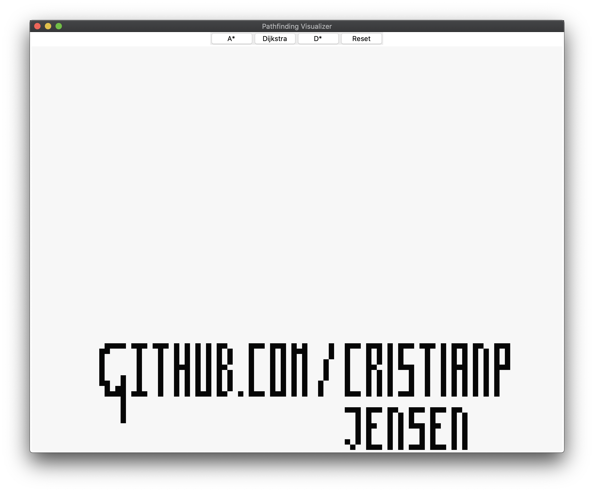
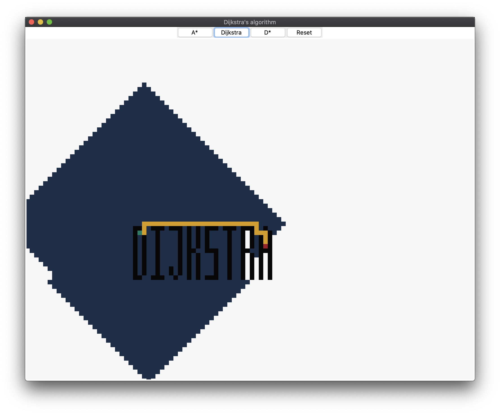
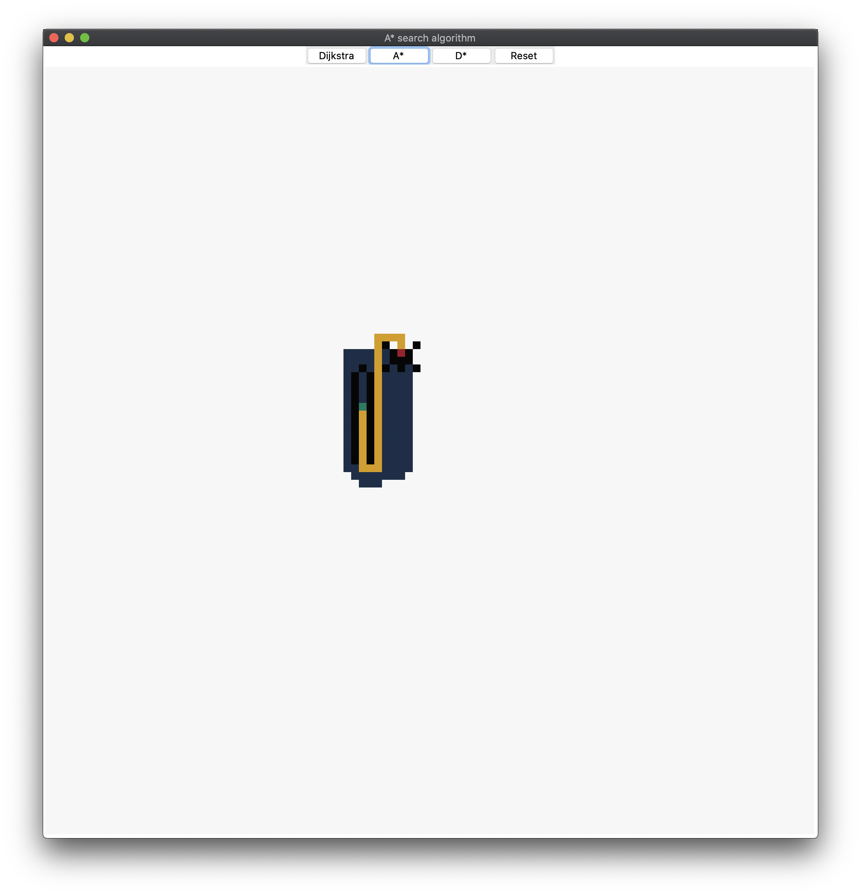

# Pathfinding Visualizer
This _python_ application visually - using [Tkinter](https://wiki.python.org/moin/TkInter) - shows how different algorithms solve the [shortest path problem](https://en.wikipedia.org/wiki/Shortest_path_problem), which is the problem of finding a path between two vertices (or nodes) in a graph such that the sum of the weights of its constituent edges is minimized. These algorithms are visualized in a grid (instead of a graph), where the weight of each edge is equal to 1.

## GUI

  

### Manual

To create a maze, you just have to press your left mouse button and it starts drawing walls - to delete: press again - according to where your mouse is located. To create a _start_ and a _goal_, press your right mouse button; the first click sets the start point and the second click sets the goal point. In case you want to change the _start_ or _goal_, press them with the right mouse button and press elsewhere in the same way.

The GUI has 4 buttons; _A*_, _Dijkstra_, and _Reset_. The _A*_, and _Dijkstra_ buttons initiate the A* search, and Dijkstra's algorithm respectively. The _Reset_ button resets the entire grid and resets everything to it's initial state. 

### Colours

* : free;

* : wall;

* : start;

* : goal;

* : explored;

* : shortest path.

## Algorithms

### [Dijkstra's algorithm](https://en.wikipedia.org/wiki/Dijkstra%27s_algorithm)

  

For each explored node, Dijkstra's algorithm calculates the path cost to all of the neighbors, which is `current node + edge weight`. In this implementation of Dijkstra's algorithm the weight of each edge equals 1. It repeats exploring neighbours until the goal has been found. When the goal has been found, it will backtrack by going from each neighbour to the node with the lowest path cost, eventually finding back to the start.

> What is the shortest way to travel from Rotterdam to Groningen, in general: from given city to given city. It is the algorithm for the shortest path, which I designed in about twenty minutes. One morning I was shopping in Amsterdam with my young fiancée, and tired, we sat down on the café terrace to drink a cup of coffee and I was just thinking about whether I could do this, and I then designed the algorithm for the shortest path. As I said, it was a twenty-minute invention. In fact, it was published in '59, three years later. The publication is still readable, it is, in fact, quite nice. One of the reasons that it is so nice was that I designed it without pencil and paper. I learned later that one of the advantages of designing without pencil and paper is that you are almost forced to avoid all avoidable complexities. Eventually, that algorithm became to my great amazement, one of the cornerstones of my fame.

— Edsger Dijkstra, 2001.

### [A* search algorithm](https://en.wikipedia.org/wiki/A*_search_algorithm)

  

The A* search algorithm is a pathfinding algorithm, which improved upon Dijkstra's algorithm. Instead of just going off the distance from the start, the A* algorithm also takes heuristics into account. The heuristics for the A* algorithm can be calculated in various ways, however for this project the optimal method was the [Manhattan distance](https://xlinux.nist.gov/dads/HTML/manhattanDistance.html). The formula for each explored node is `f(n) = g(n) + h(n)`, where `g(n)` is the distance travelled until that point, and `h(n)` is the heuristic for that node. The algorithm keeps picking the lowest `f(n)`, until the goal has been reached.

A* was created as part of [the Shakey project](https://en.wikipedia.org/wiki/Shakey_the_robot), which had the aim of building a mobile robot that could plan its own actions.
